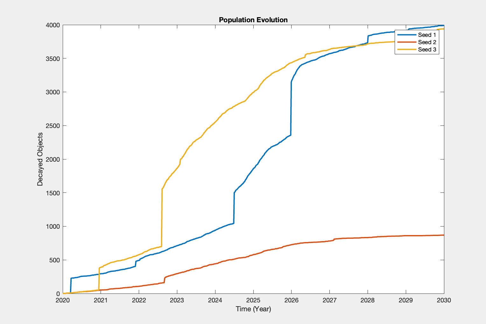

# Case Studies

## No Launch Scenario



``` MatLab
    % SCENARIO PARAMETERS
    cfgMC.PMD = 0.95;                   % POST MISSION DISPOSAL (active sats only); ESA: 55% RB, 40% PL, 90% Const
    cfgMC.alph = 0.01;                  % COLLISION AVOIDANCE failure probability with one sat active
    cfgMC.alph_a = 0;                   % COLLISION AVOIDANCE failure probability with both sat active
    cfgMC.orbtol = 5;                   % orbit control tolerance for controlled satellites [km]
    cfgMC.step_control = 2;             % orbit control tolerance checking timesteps
    cfgMC.P_frag = 0;                   % EXPLOSION PROBABILITY per day of Rocket Body Fragmentation (if P_frag=0, explosions are not considered!)
    cfgMC.P_frag_cutoff = 18;           % EXPLOSION PROBABILITY age at which objects don't explode.
    cfgMC.altitude_limit_low = 200;     % SHELL lower limit of altitude [km] 
    cfgMC.altitude_limit_up = 2000;     % SHELL upper limit of altitude [km]
    cfgMC.missionlifetime = 8;          % PAYLOADS operational life [years]

    % SET PROPAGATION TIMES
    t0_prop = 0;                                    % initial PROPAGATION time [min]
    nyears = 10;                                    % length of PROPAGATION [years]
    tf_prop = cfgMC.YEAR2MIN * nyears;              % length of PROPAGATION [min]
    cfgMC.dt_days = 5;                              % CUBE METHOD and PROPAGATION sampling time [days]
    DeltaT = cfgMC.dt_days*cfgMC.DAY2MIN;           % CUBE METHOD and PROPAGATION sampling time [min]
    cfgMC.tsince = t0_prop:DeltaT:t0_prop+tf_prop;  % PROPAGATION time list
    cfgMC.n_time = length(cfgMC.tsince);            % length of PROPAGATION time list
```


