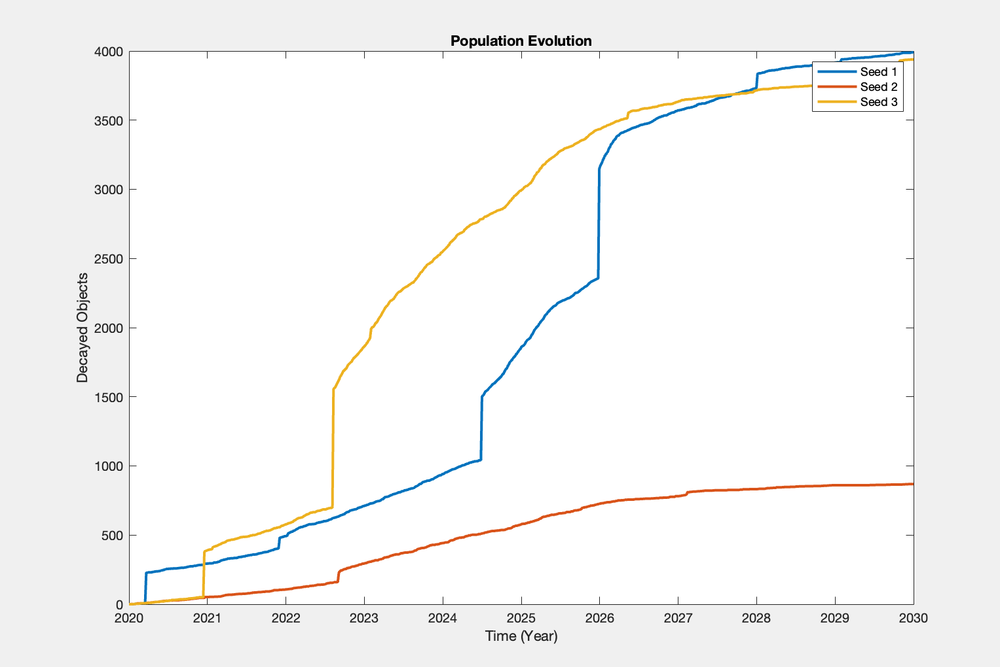

# No Launch Scenario



Changes made to setup_MCconfig file:
``` Py
    % SET PROPAGATION TIMES
    t0_prop = 0;                                    % initial PROPAGATION time [min]
    nyears = 10;                                    % length of PROPAGATION [years]

    % LAUNCHES
    Simulation = 'TLE';                     % 'TLE'
    launch_model = 'no_launch';             % random, matsat, no_launch, data, Somma      
    % 0: random launch via poisson distribution (see initSim below)
    % 1: repeat launches between years X and Y (ESA style launch)
    
    cfgMC.launchRepeatYrs = [2018,2022];    % Min/max year of obj to repeatedly launch (inclusive)
```

